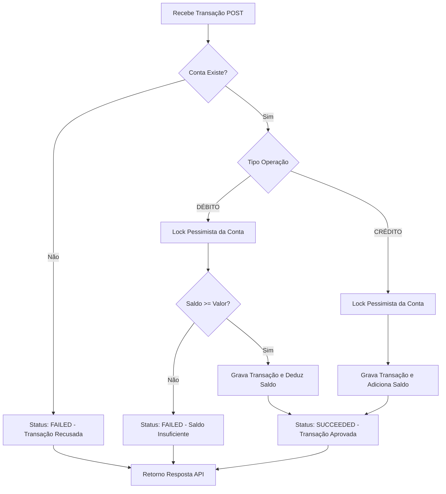

# Autorizador de Transações - Core Banking

Este projeto consiste em uma API de autorização de transações financeiras de alta performance e consistência, desenvolvida para o desafio técnico do Itaú Unibanco.

## 🛠️ Tecnologias e Especificações

- **Java 21**
- **Spring Boot 3.x**
- **Banco de Dados**: PostgreSQL (ACID Compliance)
- **Mensageria**: AWS SQS (Localstack para ambiente local)
- **Arquitetura**: Hexagonal (Ports and Adapters)

## 🚀 Como Rodar a Aplicação

O ecossistema local depende de containers Docker para o banco de dados e mensageria, e da própria aplicação Spring Boot.

### Subir a Infraestrutura (Docker)
Primeiro, é necessário inicializar o banco de dados PostgreSQL, o LocalStack (AWS SQS mock) e o gerador de massa de dados. Na raiz do projeto, execute o comando:
```bash
docker-compose up -d
```

Para testar as transações, você precisará do ID de uma conta que já foi processada. Você pode capturar um ID válido executando o comando abaixo diretamente no seu terminal:
```bash
docker exec -it postgres-db psql -U postgres -d postgres -c "SELECT id, status FROM accounts LIMIT 5;"
```
Copie um dos UUIDs retornados na coluna id (ex: 446cde51-790d-46bc-8f54-95f5e63482bb). Você o usará no próximo passo.

Com a aplicação rodando e um accountId válido em mãos, utilize os comandos curl abaixo para simular as operações.

Atenção: Substitua COLOQUE-SEU-UUID-AQUI pelo ID que você copiou no passo anterior.

```json
Teste 1: Transação de Débito (Retirada)

curl -X POST http://localhost:8080/transactions \
  -H "Content-Type: application/json" \
  -d '{
    "accountId": "COLOQUE-SEU-UUID-AQUI",
    "operationType": "DEBIT",
    "amount": 100.00,
    "currency": "BRL"
  }'
Teste 2: Transação de Crédito (Depósito)

curl -X POST http://localhost:8080/transactions \
  -H "Content-Type: application/json" \
  -d '{
    "accountId": "COLOQUE-SEU-UUID-AQUI",
    "operationType": "CREDIT",
    "amount": 500.00,
    "currency": "BRL"
  }'
```

O sistema retornará os detalhes da operação e o saldo atualizado da conta:
```json
{
	"transaction": {
		"id": "8e8ae808-b154-48b5-9f3e-553935cc4543",
		"type": "DEBIT",
		"amount": {
			"value": 100.00,
			"currency": "BRL"
		},
		"status": "SUCCEEDED",
		"timestamp": "2026-04-15T22:31:55-03:00"
	},
	"account": {
		"id": "446cde51-790d-46bc-8f54-95f5e63482bb",
		"balance": {
			"amount": 900.00,
			"currency": "BRL"
		}
	}
}
```

## 🏛️ Decisões Arquiteturais (ADRs)

### ADR 001: Arquitetura Hexagonal
- **Decisão**: Isolamento da lógica de domínio (Core) das dependências de infraestrutura.
- **Motivador**: Garante testabilidade isolada e protege as regras de negócio de mudanças em frameworks ou drivers externos.
- **Trade-off**: Introduz maior verbosidade e necessidade de mappers.

### ADR 002: Banco de Dados Relacional (PostgreSQL)
- **Decisão**: Persistência em RDBMS com suporte estrito a transações ACID.
- **Motivador**: Integridade referencial e atomicidade são requisitos fundamentais para sistemas de conta corrente.

### ADR 003: Idempotência no Consumo de SQS
- **Decisão**: Implementação de processamento idempotente para a criação de contas.
- **Motivador**: Mensagens no SQS podem ser entregues mais de uma vez (at-least-once delivery); precisamos garantir que uma conta não seja duplicada ou tenha seu saldo resetado.

## 🔄 Fluxo de Autorização

O diagrama abaixo ilustra o fluxo lógico de uma transação desde a recepção até a aprovação final:

